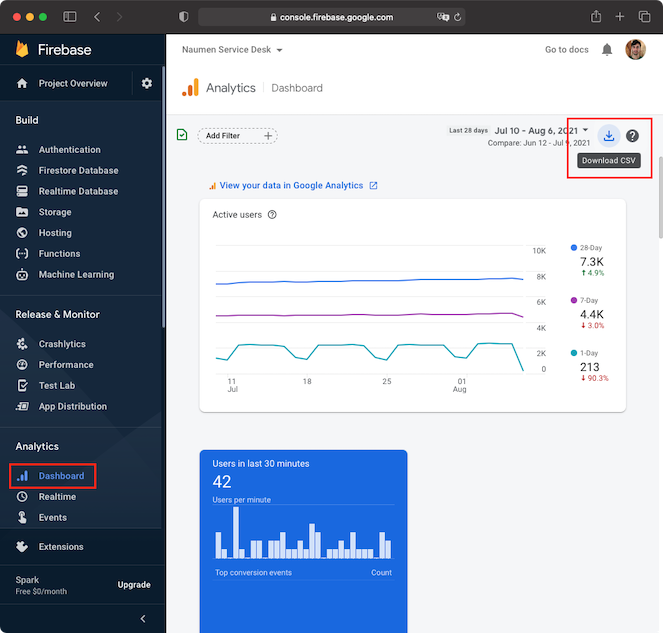

# Парсер csv-отчета из дашборда Firebase

На текущий момент позволяет структурировать информацию о версиях OS (iOS и Abdroid) и выводить ее в табличном виде.

## Установка

Скопируйте файл `fdr` (он уже заранее скомпилирован и находится в папке `bin`) в папку `/usr/local/bin/`

## Возможности

### Вывод таблиц с версиями OS (iOS и Android)

Утилита `fdr` позволяет вывести информацию о версиях OS в удобном табличном виде.

Чтобы вывести таблицы по iOS и Android, возвользуйтесь командой:

```bash
fdr osversions data-export.csv
```

где `data-export.csv` - путь до csv-файла, скаченного из раздела Dashboard на https://console.firebase.google.com:



В результате выполнения команды вы увидете следующий результат:

```
From 07.05.2021 to 04.08.2021
iOS is used by 39.5% of users
+------------+-------+------+
| OS version | Users | %    |
+------------+-------+------+
| iOS 15     | 32    | 0.6  |
| iOS 14     | 5131  | 90.0 |
| iOS 13     | 199   | 3.5  |
| iOS 12     | 300   | 5.3  |
| iOS 11     | 28    | 0.5  |
| iOS 10     | 14    | 0.2  |
+------------+-------+------+

From 07.05.2021 to 04.08.2021
Android is used by 60.5% of users
+------------+-------+------+
| OS version | Users | %    |
+------------+-------+------+
| Android 12 | 1     | 0.0  |
| Android 11 | 1959  | 22.4 |
| Android 10 | 3981  | 45.5 |
| Android 9  | 1210  | 13.8 |
| Android 8  | 823   | 9.4  |
| Android 7  | 519   | 5.9  |
| Android 6  | 154   | 1.8  |
| Android 5  | 77    | 0.9  |
| Android 4  | 22    | 0.3  |
+------------+-------+------+
```

Можно использовать флаг `--join`, чтобы вывести одну общую таблицу по всем версиям OS:

```
fdr osversions --join data-export.csv
```

Таблица примет следующий вид:

```
From 07.05.2021 to 04.08.2021
+------------+-------+----------------+----------+--------------+
| OS version | Users | % of all users | % of iOS | % of Android |
+------------+-------+----------------+----------+--------------+
| iOS 15     | 32    | 0.2            | 0.6      |              |
| iOS 14     | 5131  | 35.5           | 90.0     |              |
| iOS 13     | 199   | 1.4            | 3.5      |              |
| iOS 12     | 300   | 2.1            | 5.3      |              |
| iOS 11     | 28    | 0.2            | 0.5      |              |
| iOS 10     | 14    | 0.1            | 0.2      |              |
| Android 12 | 1     | 0.0            |          | 0.0          |
| Android 11 | 1959  | 13.6           |          | 22.4         |
| Android 10 | 3981  | 27.6           |          | 45.5         |
| Android 9  | 1210  | 8.4            |          | 13.8         |
| Android 8  | 823   | 5.7            |          | 9.4          |
| Android 7  | 519   | 3.6            |          | 5.9          |
| Android 6  | 154   | 1.1            |          | 1.8          |
| Android 5  | 77    | 0.5            |          | 0.9          |
| Android 4  | 22    | 0.2            |          | 0.3          |
+------------+-------+----------------+----------+--------------+
```

## One More Thing

Если вам станет грустно, вы можете разделить свою грусть вместе с котиком, выполнив команду:

```bash
fdr cat
```
Результат не заставит себя ждать:

```
　　　　　／＞　 フ
　　　　　| 　_　 _|
　 　　　／`ミ _x 彡
　　 　 /　　　 　 |
　　　 /　 ヽ　　 ﾉ
　／￣|　　 |　|　|
　| (￣ヽ＿_ヽ_)_)
　＼二つ
```